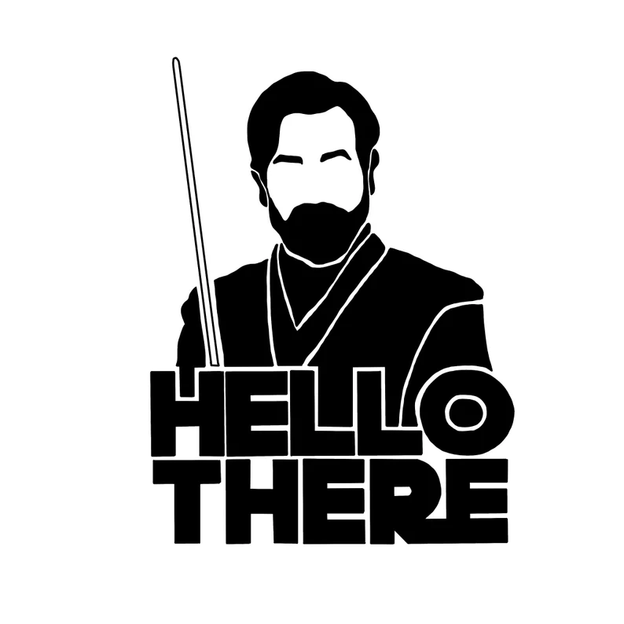

<h1 align='center'>
  
  
 
  
</h1>

  A mobile and .net developer from Brazil.

  &nbsp;&nbsp;
  &nbsp;&nbsp;

----
# Get to know me

Institution | Major | Degree Type | Completed |
---- | ---- | ---- | ---- | 
University of California, Los Angeles | Computer Science & Engineering | B.S. | 2023 |
Cypress College | Arts & Humanities | A.A. | 2018 |
Cypress College | Mathematics & Science | A.A. | 2018 |

- I am interested in working with Software Development, Video Game Development, Data Science, AI, ML

-----

----

###
How to reach me: <a href=”mailto:scjcbaker24@gmail.com”>scjcbaker24@gmail.com</a>

-----

## Top repositories

<!--
**rebelskywalker/rebelskywalker** is a ✨ _special_ ✨ repository because its `README.md` (this file) appears on your GitHub profile.

Here are some ideas to get you started:

- 🔭 I’m currently working on ...
- 🌱 I’m currently learning ...
- 👯 I’m looking to collaborate on ...
- 🤔 I’m looking for help with ...
- 💬 Ask me about ...
- 📫 How to reach me: ...
- 😄 Pronouns: ...
- ⚡ Fun fact: ...
-->

